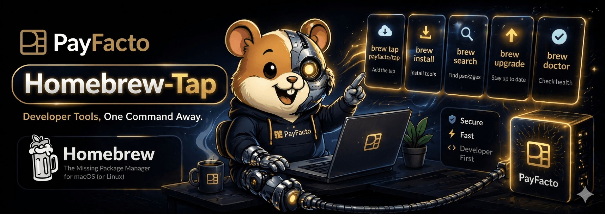

# homebrew-tap

Homebrew formulae for [payfacto](https://github.com/payfacto) tools.

## Usage

```sh
brew tap payfacto/tap
```

Then install any available formula:

```sh
brew install payfacto/tap/bb
```

```sh
brew install payfacto/tap/tokentally
```

## Formulae

| Formula | Description |
|---------|-------------|
| [bb](https://github.com/payfacto/bb) | Bitbucket Cloud CLI — manage PRs, pipelines, branches, and more |
| [TokenTally](https://github.com/payfacto/tokentally) | A desktop app with live dashboards for tracking Claude Code token usage, costs, and session history. |

## Updating

Formulae are updated automatically via GoReleaser when a new version is released. To update locally:

```sh
brew update
```

```sh
brew upgrade bb
```

```sh
brew upgrade tokentally
```

## Documentation

brew help, man brew or check [Homebrew's documentation](https://github.com/aws/homebrew-tap#:~:text=Homebrew%27s%20documentation)


